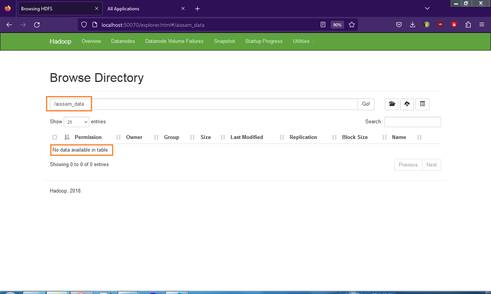

# Install Hadoop in Windows 7
A guide to walk through the Hadoop installation process on windows 7 (for Windows 10 see [How to install Hadoop in 5 Steps in Windows 10](https://medium.com/analytics-vidhya/hadoop-how-to-install-in-5-steps-in-windows-10-61b0e67342f8)). 
This tutorial will show how to install Hadoop on Windows 7, breaking down the installation into clear steps. 

## Table of Contents

- [I- Download Files](#user-content-i--download-files)
- [II- Setup Folders and Files](#user-content-ii--setup-folders-and-files)
- [III- Setup Environment Variables](#user-content-iii--setup-environment-variables)
- [IV- Setup Configuration Files](#user-content-iv--setup-configuration-files)
- [V- Testing](#user-content-v--testing)
- [VI- Some Hadoop Commands](#user-content-vi--some-hadoop-commands)
- [VII- Stop Hadoop](#user-content-vii--stop-hadoop)

## I- Download Files 

* Download Hadoop [hadoop-2.9.2.tar.gz](https://archive.apache.org/dist/hadoop/core/hadoop-2.9.2/)


* Download [java 11](https://www.oracle.com/java/technologies/javase/jdk11-archive-downloads.html)


* Download [winutils](https://github.com/cdarlint/winutils/tree/master), we will need the bin files that are in [hadoop-2.9.2/bin](https://github.com/cdarlint/winutils/tree/master/hadoop-2.9.2/bin)


## II- Setup Folders and Files 

1. **Create new folder in `C:\` named `hadoop`** 


We will extract `hadoop-2.9.2.tar.gz` to this folder `C:\hadoop\`.


2. **Created 3 folders** 
- First folder named `data`, should be created in `C:\hadoop\hadoop-2.9.2\`. Like `C:\hadoop\hadoop-2.9.2\data`.


- Second folder named `datanode`, should be created in `C:\hadoop\hadoop-2.9.2\data\`. Like `C:\hadoop\hadoop-2.9.2\data\datanode`.
- Third folder named `namenode`, should be created also in `C:\hadoop\hadoop-2.9.2\data\`. Like `C:\hadoop\hadoop-2.9.2\data\namenode`.


3. **Extract the `winutils-master.zip` file** 


Enter to `winutils-master` :


We will using Hadoop 2.9.2 :


so we will copy all files that are in the bin folder of hadoop-2.9.2 folder `winutils-master\hadoop-2.9.2\bin\` : 


to `C:\hadoop\hadoop-2.9.2\bin`. Replacing all files : 


4. **Setup Java 11** 
To avoid errors, create a folder in `C:\` named `java`, then extract the `jdk-11.0.19_windows-x64_bin.zip` file to `C:\java`, (like we did in step II-1-) :


Here is the output of the extreaction :


## III- Setup Environment Variables 
click on `windows key` then search for `environment variables`, then click on `edit environment variables for your account`


1. **JAVA_HOME :** 
If you don't have a `JAVA_HOME` variable, click on `new` to add it :


- Then in the `variable name` type : 
```plaintext 
JAVA_HOME
```
- And in the `variable value` type : 
```plaintext 
C:\java\jdk-11.0.19
```


2. **HADOOP_HOME :** 
- Click on `new` to add `HADOOP_HOME` variable, then in the `variable name` type : 
```plaintext 
HADOOP_HOME
```
- And in the `variable value` type : 
```plaintext 
C:\hadoop\hadoop-2.9.2
```


3. **Path :** 
Scroll to `Path` and select it, then click on `Edit`, and add this to the begining of  `variable value` type : 
```plaintext 
%JAVA_HOME%\bin;%HADOOP_HOME%\bin;%HADOOP_HOME%\sbin;
```


4. **Verifying :** 
* Verifying `Java` : 
Open cmd and type :
```batch
java -version
```
The output should be like : 
```plaintext 
java version "11.0.19" 2023-04-18 LTS
Java(TM) SE Runtime Environment 18.9 (build 11.0.19+9-LTS-224)
Java HotSpot(TM) 64-Bit Server VM 18.9 (build 11.0.19+9-LTS-224, mixed mode)
```


* Verifying `JAVA_HOME` :
In cmd type :
```batch
echo %JAVA_HOME%
```
The output should be like : 
```plaintext 
C:\java\jdk-11.0.19
```


* Verifying `HADOOP_HOME` :
In cmd type :
```batch
echo %HADOOP_HOME%
```
The output should be like : 
```plaintext 
C:\hadoop\hadoop-2.9.2
```


* Verifying `PATH` :
In cmd type :
```batch
echo %PATH%
```
The output should be like : 
```plaintext 
C:\java\jdk-11.0.19\bin;C:\hadoop\hadoop-2.9.2\bin;C:\hadoop\hadoop-2.9.2\sbin;C:\Use...
```


## IV- Setup Configuration Files 

Go to `C:\hadoop\hadoop-2.9.2\etc\hadoop` to find the file that we will edit.


1. **Modifying the `core-site.xml` file :** 
```plaintext
<configuration>
    <property>		
        <name>hadoop.tmp.dir</name>
        <value>C:\hadoop\hadoop-2.9.2\tmp</value>
    </property>

    <property>
        <name>fs.default.name</name>
        <value>hdfs://localhost:9000</value>
    </property>
</configuration>
```

2. **Modifying the `hdfs-site.xml` file :** 
```plaintext
<configuration>
  <property>
    <name>dfs.replication</name>
    <value>1</value>
  </property>

  <property>
    <name>dfs.namenode.name.dir</name>
    <value>C:\hadoop\hadoop-2.9.2\data\namenode</value>
  </property>

  <property>
    <name>dfs.datanode.data.dir</name>
    <value>C:\hadoop\hadoop-2.9.2\data\datanode</value>
  </property>
</configuration>
```

3. **Modifying the `mapred-site.xml` file :** 
```plaintext
<configuration>
    <property>
        <name>mapreduce.framework.name</name>
        <value>yarn</value>
    </property>
</configuration>
```

4. **Modifying the `yarn-site.xml` file :** 
```plaintext
<configuration>
  <property>
    <name>yarn.nodemanager.aux-services</name>
    <value>mapreduce_shuffle</value>
  </property>

  <property>
    <name>yarn.nodemanager.aux-services.mapreduce.shuffle.class</name>
    <value>org.apache.hadoop.mapred.ShuffleHandler</value>
  </property>
</configuration>
```

5. **Verifying the `hadoop-env.cmd` file :** 
- Make sure that JAVA_HOME is set correctly :
```plaintext
    set JAVA_HOME=%JAVA_HOME%
```

## V- Testing 

1. **Verifying hadoop :** 
Use this command in the cmd :
```batch
hadoop version
```


2. **Formatting Namenode :** 
Only for the first time to start hadoop use : 
```batch
hdfs namenode -format
```

3. **Start hadoop :** 
First run : 
```batch
start-dfs
```
and two windows will popup : 


Then run : 
```batch
start-yarn
```
and two windows will popup : 


4. **jps :** 
To verify that all works, run : 
```batch
jps
```
The output is like : 
```plaintext
6896 NodeManager
6388 ResourceManager
8488 DataNode
2028 NameNode
9788 Jps
```


5. **Verify namenode :** 
In a browser, open this link : 
```plaintext
localhost:50070
```


6. **Verify Resourcemanger :** 
In a browser, open this link : 
```plaintext
http://localhost:8088
```


## VI- Some Hadoop Commands 

1. **Create a folder in hdoop hdfs:** 
let's start with creating a folder :
```batch
hadoop fs -mkdir /aissam_data
```
and show it :
```batch
hadoop fs -ls /
```


To see it in the browser, open this link : 
```plaintext
localhost:50070
```


When we click on  `aissam_data` we see that it is empty : 




2. **copy data example to it :** 
I have a file in my computer names `myData.txt`, that have this text inside it:
```plaintext
windows data Big
windows 7 installation BigData
10 guid Big Data
TESTY TEST
Windows
```
So, let't cpoy it to hadoop:
```batch
hdfs dfs -put C:\hadoop\myData.txt /aissam_data/data_.txt
```


To list it :
```batch
hdfs dfs -ls /
```
```batch
hdfs dfs -ls /aissam_data
```


To see its size : 
```batch
hadoop fs -du /aissam_data/data_.txt
```


To see its contenue : 
```batch
hadoop fs -cat /aissam_data/data_.txt
```


* for more command, see /2_hadoop_commands\hadoop_commands.txt

## VII- Stop Hadoop 
To stop run : 
```batch
stop-dfs
```


Then run : 
```batch
stop-yarn
```


